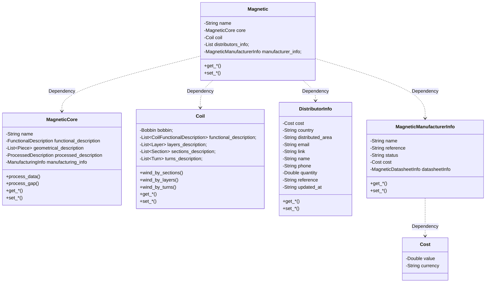

# Magnetic

> Walk-through of the `magnetic` section of a MAS document. For unit
> conventions see [`units.md`](units.md); for the standards MAS defers
> to and the IEV vocabulary anchors see
> [`normative-references.md`](normative-references.md).

The `magnetic` section describes the physical component itself —
distinct from the inputs (operating points and design requirements) and
from the outputs (computed results). It is composed of a `core` and a
`coil`; the `coil` may reference a `bobbin`. This chapter walks through
how each of these is described.

It is a common practice of magnetics manufacturers to decouple cores (including gaps) and windings, having collections of compatible cores and wound bobbins, which allows having a multitude of different magnetics by combining them.

I have followed the same principle for separating the different parts of the magnetic component, choosing to define the core and winding as two (almost) independent objects. Cores and windings can be defined by themselves and linked together, supporting even having magnetic cores with more than one winding window, and placing different windings in each one.

## Name
This name references the magnetic component and can be used to refer to it. This field can contain any valid string of characters, and can hold the manufacturer's reference or a description of a custom magnetic.

## Core
As defined in the [Core Section] (https://github.com/OpenMagnetics/MAS/blob/main/docs/magnetic/core.md)

## Coil
As defined in the [Coil Section] (https://github.com/OpenMagnetics/MAS/blob/main/docs/magnetic/coil.md)

## Core electrical reference
`coreElectricalReference` (optional) records how the core is referenced
electrically once the component is assembled. A ferrite or powder core has
no terminal of its own; it sits at whatever potential the conductors around
it impose, unless it is deliberately bonded — by a mounting clip, a copper
strap or flux band, or conductive tape — to a circuit reference or to one end
of a winding.

The distinction matters for the stray-capacitance and common-mode behaviour
of the part, not for its magnetics. For a winding with a linear potential
ramp and a total distributed capacitance C0 to the core, the shunt seen at
the winding's terminals is C0/12 with the core floating, C0/3 with the core
tied to either end of that winding, and approaches C0 when the live end sits
innermost against a bonded core. Bonding also diverts the primary→core→
secondary common-mode displacement current to the reference instead of
letting it close through the core.

| `type` | Meaning | Other fields |
|---|---|---|
| `floating` | Not bonded; the core takes the charge-balanced potential of its surroundings. | — |
| `grounded` | Bonded to a node with no potential swing relative to a circuit reference. | `isolationSide` (optional): which side's local ground; absent = protective earth / chassis. |
| `tiedToWinding` | Bonded to one end of a named winding and follows that node. | `winding` (required): a `coil.functionalDescription[].name`; `terminal` (required): `start` or `end` of that winding. |

**Absent means floating.** That is the state of a core with no clip, strap
or tape, and the assumption every model made before the field existed, so
adding the field to a document never changes an existing result. Catalogue
SMPS transformers ship floating (they expose no core pin); offline flyback
adapters commonly bond the core or its flux band to the primary return, and a
core clipped to a grounded heatsink or chassis is bonded whether or not the
designer intended it.

```json
"coreElectricalReference": {
    "type": "grounded",
    "isolationSide": "primary"
}
```

## Magnetic shunts
`shunts` (optional) lists the magnetic shunts fitted to the assembled component: pieces of permeable material — a ferrite plate, a ferrite-polymer or flexible-ferrite sheet — put deliberately where the leakage flux runs, which is how an integrated-leakage transformer (an LLC with its series inductance built in, a flyback with a designed leakage, a current-limiting transformer) gets the leakage inductance it is designed for. A shunt belongs to neither the core nor the coil: it is added at assembly, usually by the winder, and it is not a conductor, so it is described here, at the level of the assembled part, in the order the shunts are fitted. It is deliberately not put in `core.geometricalDescription`, which is regenerated on autocomplete.

Each shunt states where it sits and what it is made of. `placement` is its flux topology, and a model has to branch on it: `inWindow` anywhere inside the winding window, `betweenSections` filling the insulation gap between two sections, `onColumn` wrapped on or against a column — the one case that also changes the magnetising reluctance — and `outsideWindow` outside the window against the core. `coordinates` is the centre of the shunt referred to the centre of the main column, and `dimensions` the box enclosing it: width radially, height along the column axis (the sheet thickness of a flat shunt), depth across the window. `gapToColumns` carries the `inner` and `outer` air gaps between the shunt and the columns it bridges, which dominate the shunt branch's reluctance and are the designer's tuning knob; `segments` describes a shunt built from several pieces in series, each with its `length` and the `gap` that follows it, which is how a large leakage is trimmed in production. `material` is a core material — either the full record or the name of one — because a sheet is a permeable material and needs exactly what that schema already holds (initial and complex permeability, saturation, resistivity, loss data); insulation materials have no permeability at all. Sheet materials are filed in the bundled core-material database like any other material, with the maker in `manufacturerInfo` and the properties their datasheets do not publish left absent rather than invented; TDK's ferrite-polymer films `C350` and `C351` are already there, and the flexible sheets whose makers publish neither an initial permeability nor a saturation flux density cannot be filed at all while both are required of a core material (see [MAS-RFC 0015](../proposals/0015-magnetic-shunts.md)). Only `placement`, `coordinates`, `dimensions` and `material` are required; absent `shunts` means a part with no shunt. See [MAS-RFC 0015](../proposals/0015-magnetic-shunts.md).

```json
"shunts": [
    {
        "name": "leakage sheet",
        "placement": "betweenSections",
        "coordinates": [0.006, 0, 0],
        "dimensions": [0.004, 0.0002, 0.012],
        "gapToColumns": {"inner": 0.00009, "outer": 0.00009},
        "material": "C350"
    }
]
```


